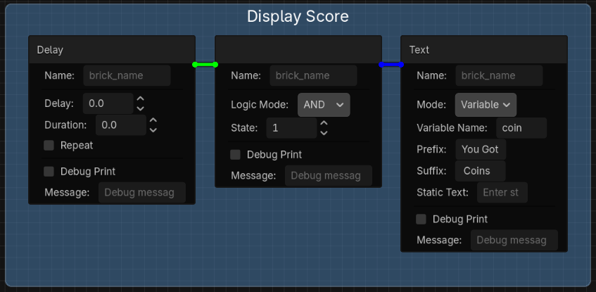
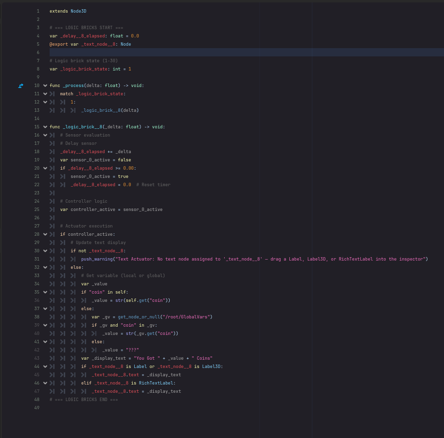

# Logic Bricks for Godot 4
## How It Works




A visual logic system for Godot 4 inspired by the Blender Game Engine (UPBGE). Build game logic with a node-graph editor using **Sensors**, **Controllers**, and **Actuators** — no coding required.

Logic Bricks generates clean, readable GDScript behind the scenes, so your projects stay lightweight and inspectable. Ideal for beginners learning game development, educators teaching game logic, or anyone who wants to prototype gameplay without writing code.

 

## How It Works

Select any 3D node, open the Logic Bricks panel, and connect bricks visually:

```
Sensor  →  Controller  →  Actuator
(input)    (logic)        (action)
```

**Sensors** detect events (input, collisions, timers, variable changes). **Controllers** evaluate conditions (AND, OR, NAND, NOR, XOR). **Actuators** perform actions (move, animate, play sounds, change scenes). Chain them together to build complete game behaviors.

## Features

- **Visual Node Graph Editor** in Godot's bottom panel — right-click to add bricks, drag to connect
- **Auto-generated GDScript** — readable code that students can learn from
- **13 Sensors** — input (keyboard, gamepad, joystick axis), collision, raycast, proximity, movement, timers, variables, messages, and more
- **5 Controller Modes** — AND, OR, NAND, NOR, XOR logic gates
- **23 Actuators** — motion, animation, camera, sound, physics, scene management, save/load, text display, and more
- **Variables Panel** — declare typed variables, export to the inspector, or mark as global (shared across scenes via autoload)
- **Expression Support** — type `speed * 2` or `horizontal * move_speed` directly in Motion and Animation fields
- **Joystick Axis Input** — analog stick support with configurable deadzone and variable storage
- **Frames** — visually group and label brick chains
- **Tooltips** — every field has built-in documentation
- **State System** — up to 30 states per node for complex behaviors (idle, walking, attacking, etc.)
- **Message System** — inter-node communication without code

## Quick Start

1. Install the plugin and enable it in Project Settings → Plugins
2. Select a **CharacterBody3D**, **RigidBody3D**, or **Node3D** in your scene
3. Open the **Logic Bricks** panel at the bottom of the editor
4. Right-click the graph → add an **InputMap Sensor**, a **Controller**, and a **Motion Actuator**
5. Connect them left to right
6. Press Play — your character moves

### Example: Joystick Character Movement

```
InputMap [Axis | negative: move_left, positive: move_right, Store In: horizontal]
  → Controller [AND] → Motion [X: horizontal * speed]

InputMap [Axis | negative: move_forward, positive: move_back, Store In: vertical]
  → Controller [AND] → Motion [Z: vertical * speed]
```

### Example: Coin Collection with Global Score

```
Collision Sensor [Area3D: coin_area]
  → Controller [AND] → Modify Variable [coin, Add, 1]
                      → Sound [coin_sfx]

Compare Variable [coin == 5]
  → Controller [AND] → Game [Change Scene: win_screen.tscn]
```

The `coin` variable marked as Global persists across scenes — display it on your win screen with a Text Actuator.

## Brick Reference

### Sensors
Always, Animation Tree, Collision, Compare Variable, Delay, InputMap (button + axis), Message, Mouse, Movement, Proximity, Random, Raycast, Timer

### Controllers
AND, OR, NAND, NOR, XOR

### Actuators
Animation, Animation Tree, Camera, Character (gravity + jump), Collision, Edit Object, Game, Look At Movement, Message, Modify Variable, Motion, Mouse, Move Towards, Parent, Physics, Property, Random, Save Game, Scene, Sound, State, Teleport, Text

## Installation

### Asset Library
1. In Godot, go to **AssetLib** → search **"Logic Bricks"** → Download → Install
2. **Project → Project Settings → Plugins → Logic Bricks → Enable**

### Manual
1. Copy the `addons/logic_bricks` folder into your project's `addons/` directory
2. **Project → Project Settings → Plugins → Logic Bricks → Enable**

## Requirements

- Godot 4.3+
- GDScript only (no C# dependency, no GDExtension)

## License

MIT — see [LICENSE](LICENSE)
